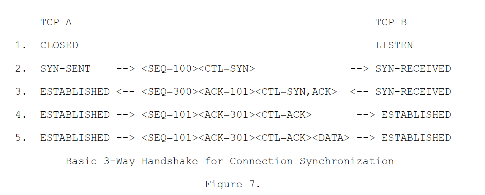
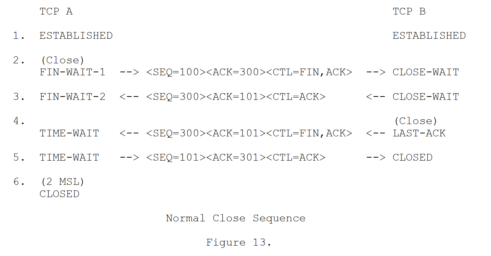

+++
author = "yidongxue"
title = "每日任务"
date = "2024-01-17"
description = "每日必看内容"
categories = [
    "基础"
]
tags = [
    "每日任务"
]
+++

# 每日任务

## 1、默写冒泡算法

~~~c
/*冒泡插入排序思路*/
//如果采用从左向右的顺序，假设要实现递增排序，则是把元素大的向后移动
void BubbleSort(int *buf,int bufsize)
{
	int temp; //用于临时备份数据，为了进行元素交换

	//该循环用于记录轮次
	for (int i = 1; i < bufsize; i++ )       						
	{
		//该循环用于记录一轮中需要交换的次数
		for (int j = 0; j < bufsize - i; j++)
		{
			//用于比较两个相邻元素的值的大小，如果前面元素值大，则交换两个元素的值
			if (buf[j] > buf[j+1])
			{
				//需要交换两个元素的值，需要3句赋值语句完成，借用temp作为临时变量
				temp = buf[j];
				buf[j] = buf[j + 1];
				buf[j + 1] = temp;
			}
		}
	}
}
~~~

----

## 2、画挥手和握手

### 2.1 三次握手

---

### 2.2、四次挥手

---

## 进程与线程

---

进程是系统分配资源的基本单位

线程是系统调度的最小单位

---

## 3、记忆单词

---

process     进程

section     节

segment     段

archive     架构

content     内容

sched      调度

report      报告

snapshot     快照

display     显示

information   信息

options         选项

referring        指

copyright       著作权

schedule        附表, 安排

specifies        指定

thread         线程

identifier        描述符

manner        方式

prescribe       规定

array          数组

permitted       允许

field           字段

associated      相关

individual       个人、各个

Property        属性

Geometry       几何学

Relative        相对

Caption        标题

Horizontal      水平

Scroll          滚动

Margins        边缘

Compiler       编译器

Process         进程、处理

Preprocess      预处理

Assemble       汇编

Summary       总结

Executable      可执行的

Linkable        可连接的

Format         格式

Segment       段

Section         节

Symbol         象征

Task           任务

sector 		扇区

block 		区

volatile		易变的

content		内容

inherit		继承

asynchronous			异步的

synchronous 				同步的

store			存储

architecture		架构

channel			通道

decode			解码

encode			编码

enable			使能

disable			使能

overview			总述

realtime			实时

suspend		挂起

semaphore		信号量

generate			生成

field			成员

interface		接口

condition		条件

critical resource 	临界资源

aligned			对齐

attache		追加

increase		增加

decrease		递减

detached		分离

mutex			互斥量

global			全局

element		元素

attribute			属性

initial			初始化

priority			优先级

schedule policy		调度策略

round robin		轮询

datagram		数据报

sequence		顺序

combination	组合

port			端口

convert		继续

lest significance byte		低字节先出（小端）

big  significance byte		高字节先出（大端）

---

