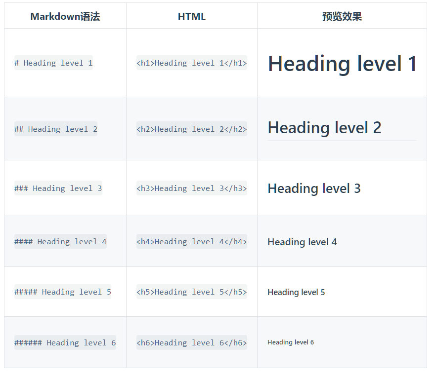

# 1 、markdown基础语法

千万不要被「标记」、「语言」吓到，Markdown的语法十分简单，常用的标记符号不超过十个，用于日常写作记录绰绰有余，不到半小时就能完全掌握。

就是这十个不到的标记符号，却能让人**优雅地沉浸式记录，专注内容而不是纠结排版**，达到「心中无尘，码字入神」的境界。来自官方的说法

## 1、标题语法

每添加一个 **#** 表示一级标题，比如：

#+空格表示一级标题
##+空格+内容表示二级标题，依次类推。

## 2、段落

**使用段落请使用空白一行，不要使用制表符（TAB）缩进。**

## 3、换行

在一行的末尾按下 **shift** 和  **enter** 即可换行

First line with two spaces after. And the next line.

## 4、强调语法

### 粗体

在要加粗的字的两侧添加**，即可。

### 斜体

在添加的字体两侧

